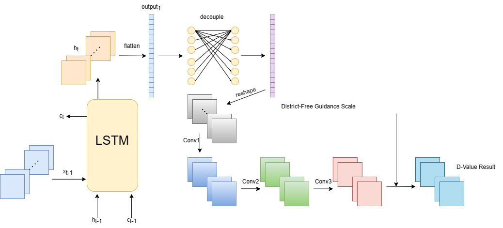

# 2023-A32-WorkList


## district-free scale based few-shot time serie fitting method
English version

**Introduction**


Using LSTM and convolutional neural network, as well as renet, we solve the data correcting problem with finally $R^2\ge0.98$.

We propose an improvement of the using of the ResNet with an extra scale called *district-free guidance scale*, which can be simply denoted as *dfg-scale*. With this dfg-scale, our model gain the migration ability from district to district.

**Attention**: the *district-free guidance scale* improve the ability of the model in migration, generalization but not model's accurancy. Though the accurancy($R^2$) may actually enhanced by led in dfg-scale. 

On the other hand, our model is capable of self-study ability（automatic fine tune） on a few-shot dataset based on pretrained weights. Namely, show some data (few-shot dataset, with standard station data) to our pretrained-model, it can find a scale which makes $R^2$ criterion reached the most value on this few-shot term. After this searching step, the model find the scale which fit the few-shot term the most and then run on total dataset to amend the data.

### environment set up and dependencies install
To set up, we need $torch\ge1.11.0$. If pytorch has been installed under the base environment in anaconda, you can directly install our dependencies(packages) by running
```bat
pip install -r requirements.txt
```
in terminal.

Otherwise, you should install our environment from scratch by running
```bat
conda env create -f environment.yaml
```
in order to use our project.

### 


## 基于免地域指引比例的小时域数据适应方法
中文版

### 简介

使用LSTM记忆网络和卷积神经网络以及残差连接网络，我们解决数据矫正任务，所得最终的校验结果为$R^2\ge0.98$

我们提出了针对使用残差连接网络时的一个优化，通过过引入一个“免地域指引比例”，简写为“dfg-scale”。通过dfg-scale，我们的模型获得了将学习获得的效果在地域间迁移的能力。通过使用这个dfg-scale，我们的模型获得了从一个地区到另一个地区的迁移能力。

**注意**：dfg-scale的使用是模型的迁移能力和泛化能力得到了提高，而不会影响模型的准确率。尽管这个准确率($R^2$)可能实际上确实会被前者影响。

另一方面，我们的预训练模型拥有小数据集（few-shot）上的的自学能力（自动微调）。即，通过向我们的预训练模型投喂一定的数据（小数据集，有标准站数据），它能够找到一个使$R^2$最大的dfg-scale值。在搜索之后，模型能够找到是的在这个小数据集上表现最好的dfg-scale值，然后使用这个dfg-scale来矫正整个数据集上的数据。


### 环境部署与依赖安装
先部署我们的环境，首先要求保证torch$\ge 1.11.0$，如果在anaconda的base环境中已经安装过pytorch，那么可以直接按照我们的包依赖，在终端运行
```bat
pip install -r requirements.txt
```
否则，需要先运行
```bat
conda env create -f environment.yaml
```
才能使用我们的项目


###